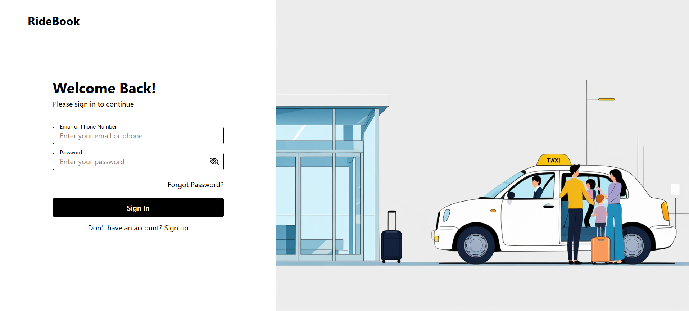
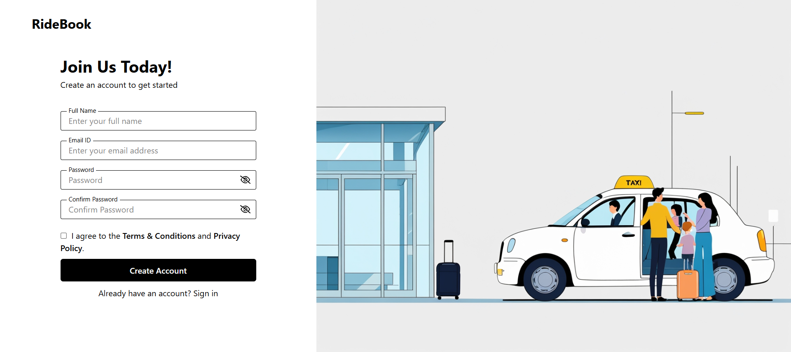
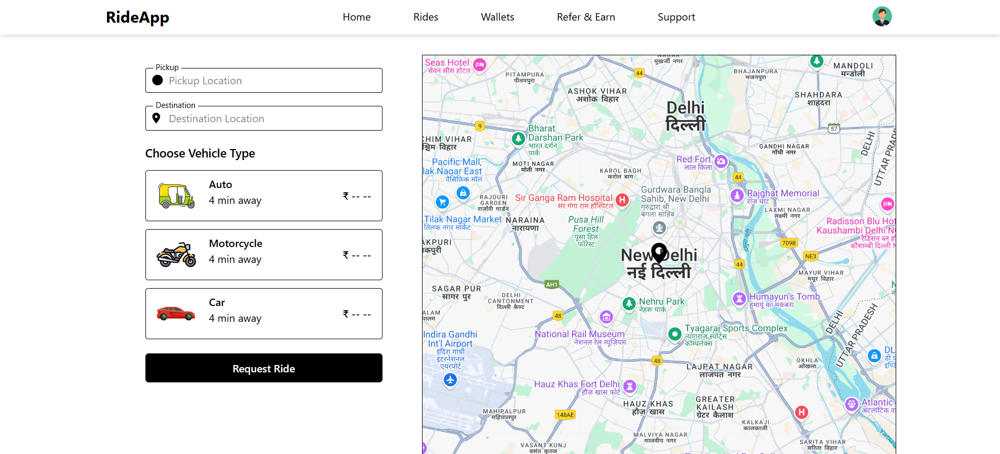
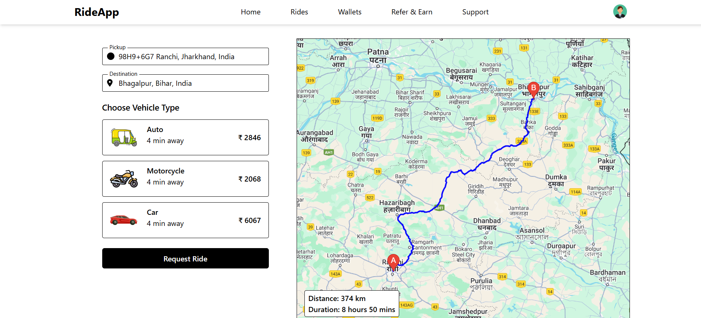
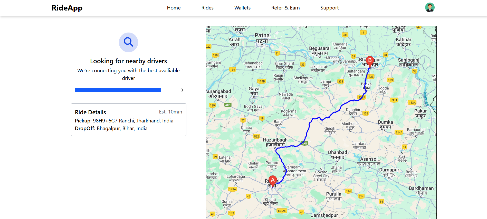

# RideBook

RideBook is a modern ride-hailing application built with React and Node.js that connects passengers with drivers. The application features real-time location tracking, secure authentication, and an intuitive booking interface.

## Features

- **User Authentication**
  - Email/Phone registration with verification
  - Secure login with JWT tokens
  - Password reset functionality
  - Session management

- **Real-time Tracking**
  - Live location tracking using Google Maps
  - Real-time driver-passenger communication via Socket.IO
  - Trip progress monitoring

- **Ride Management**
  - Easy ride booking interface
  - Multiple pickup/destination points
  - Distance and fare calculation
  - Ride history

## Tech Stack

### Frontend
- React 19
- Vite
- Redux Toolkit
- @vis.gl/react-google-maps
- Socket.IO Client
- TailwindCSS

### Backend
- Node.js
- Express.js
- MongoDB
- Socket.IO
- JWT Authentication
- Nodemailer

## Getting Started

### Prerequisites
- Node.js 18+
- MongoDB
- Google Maps API Key

### Installation

1. Clone the repository:
```bash
git clone [repository-url]
```

2. Install backend dependencies:
```bash
cd backend
npm install
```

3. Install frontend dependencies:
```bash
cd frontend
npm install
```

4. Configure environment variables:

Copy .env.example to .env in both frontend and backend directories
Fill in required environment variables

5. Start the development servers:

Backend:
```bash
cd backend
npm run dev
```

Frontend:
```bash
cd frontend
npm run dev
```


## Screenshots

### Login Page


### Signup Page



### Dashboard Page




## API Endpoints
User Routes
- POST /api/v1/user/register - Register new user
- GET /api/v1/user/verify-email - Verify email address
- POST /api/v1/user/login - User login
- GET /api/v1/user/profile - Get user profile
- POST /api/v1/user/forgot-password - Request password reset
- PATCH /api/v1/user/reset-password - Reset password

Captain Routes:

Map Routes:

Ride Routes: